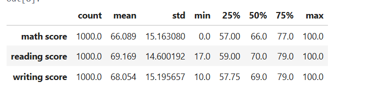
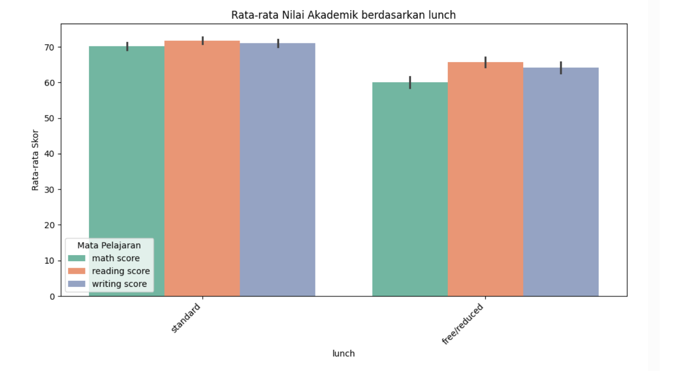
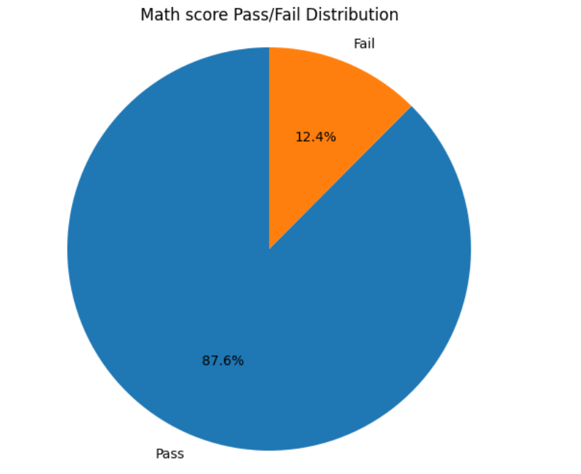
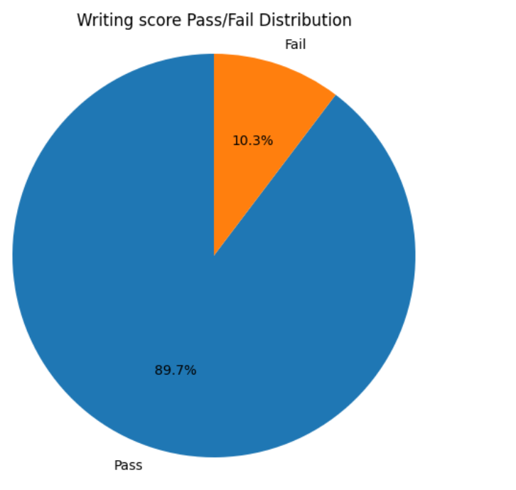
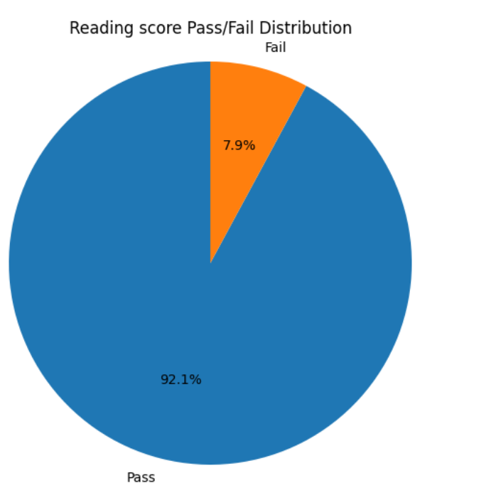
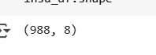
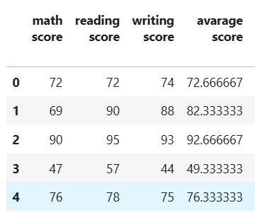
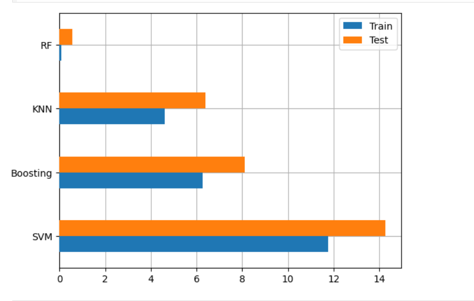
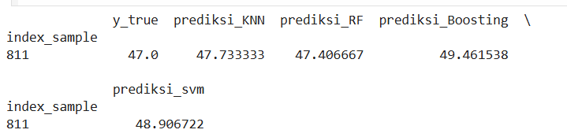

# Laporan Proyek Machine Learning - Merri Putri Panggabean

## Domain Proyek 

###  Latar Belakang 

Pendidikan merupakan salah satu faktor kunci utama dalam pembangunan suatu negara karena berperan penting dalam meningkatkan kualitas sumber daya manusia. oleh karena itu, pemahaman terhadap faktor-faktor yang memengaruhi kinerja akademik siswa sangat penting untuk meningkatkan mutu pendidikan. seiring berkembangnya teknologi dan ketersediaan data, analisis data pendidikan menjadi pendekatan yang semakin populer untuk memahami pola-pola yang memengaruhi performa belajar siswa.

Salah satu dataset yang dapat penulis analisis ialah *Student Perfomance Dataset* yang mencakup berbagai variabel seperti status sosial,  ekonomi, tingkat pendidikan orang tua dan jenis makanan yang dikelola. Melalui analisis dataset ini, penulis dapat mengindefikasi faktor-faktor utama yang berkorelasi dengan performa siswa di sekolah. Pemahaman ini dapat membantu guru, orang tua dan pembuat kebijakan dalam merancang starategi pembelajaran yang lebih efektif dan inklusif.

Masalah yang diangkat dalam proyek ini ialah **Bagaimana berbagai faktor sosial,pendidikan dan pola makan siswa memengaruhi hasil belajar siswa.** Masalah ini penting untuk diselesaikan karena ketimpangan dalam hasil pendidikan dapat berdampak pada kesempatan masa depan siswa, terutama bagi siswa yang kurang mendapat fasilitas seperti siswa pada umumnya.

Beberapa penelitian juga telah menunjukkan bahwa analisis data pendidikan dapat mengungkapkan pola yang tidak dampak secara kasat mata. Menurut *Cortex dan Silva* (2008), yang menggunakan metode data mining pada data siswa di portugal, ditemukan bahwa faktor seperti komsumsi alkohol, waktu belajar dan hubungan keluarga memiliki pengaruh signifikan terhadap performa akademik siswa[1].

Dengan hal itu, penulis bertujuan untuk melakukan analisis lebih lanjut terhadap dataset *Perfomance Student* untuk mendapatkan insight yang berguna dalam meningkatkan kualitas pendidikan.
  
## Business Understanding

Dalam dunia pendidikan, memahami faktor-faktor yang memengaruhi performa siswa sangat krusial untuk meningkatkan kualitas pembelajaran dan mencegah ketimpangan hasil akademik. Melalui pendekatan analisis data dan machine learning, penulis dapat mengklarifikasi permasalahan, merumuskan tujuan, serta menyusun solusi prediktif untuk membantu pengambilan keputusan di bidang pendidikan.

### Problem Statements
Berdasarkan latar belakang diatas, berikut batasan masalah yang akan diselesaikan dalam proyek ini :
- Apa saja faktor yang berpengaruh terhadap nilai ujian siswa?
- Bagaimana perbandingan persentase siswa yang lulus dan gagal berdasarkan akademik
- Bagaimana cara untuk memprediksi performa siswa pada nilai skor ujian membaca menggunakan KNN,SVM,RF dan BOOSTING?

### Goals

Menjawab batasan masalah yang telah dirangkum dan akan menjawab pertanyaan-pertanyaan diatas, berikut tujuan masalahnya :
- Penulis perlu untuk menganalisis faktor yang berpengaruh pada nilai skor siswa.
- Penulis perlu untuk melakukan visualisasi untuk melihat persentase siswa yang lulus dan gagal berdasarkan akademik.
- Penulis perlu untuk membangun model prediksi performa siswa menggunakan ke empat algoritma yaitu KNN,RF,SVM dan BOOSTING.

### Solution Statment

untuk mencapai tujuan diatas, maka penulis perlu melakukan pendekatan pemodelan yang dimana penulis akan menggunakan langkah-langkah seperti ini :
- Analisis  Deskriptif : penulis akan menggunakan statistik deskriptif untuk memahami distribusi data. ini mencakup semua nilai skor akademik.
- Analisis korelasi : menggunakan korelasi untuk melihat hubungan antara berbagai faktor yang mempengaruhi skor nilai siswa.
- Model Prediksi : membangun model predeksi berbasis mechine learning seperti Random Forest (RF), K-Nearest Neighbors (KNN), Boosting, Support Vector Machine (SVM) untuk menangani nilai skor ujian siswa.

**Menggunakan MSE (Mean Squared Error) pada model yang akan di evaluasi.**

## Data Understanding

Dataset yang digunakan dalam proyek ini berisi informasi tentang performa akademik siswa berdasarkan beberapa faktor demografis dan sosial, seperti jenis kelamin, kelompok etnis, tingkat pendidikan orang tua, status mengikuti kursus persiapan ujian, dan jenis makan siang yang dikonsumsi. Selain itu, dataset ini juga mencatat skor ujian siswa dalam tiga mata pelajaran utama, yaitu **matematika (math score), membaca (reading score), dan menulis (writing score).**

berikut link dataset yang dianalisa : https://www.kaggle.com/datasets/spscientist/students-performance-in-exams 

Dataset mentah yang digunakan dalam proyek ini memiliki 1000 baris data dan 8 kolom. Kolom - kolom tersebut terdiri dari 5 kolom kategori dan 3 kolom numerik. untuk penjelasan mengenai variabel-variabel pada Performance Students dataset adalah sebagai berikut:
- gender : jenis kelamin tiap siswa.
- lunch : jenis makan siang yang setiap hari di konsumsi tiap siswa.
- race/ethnicity : jenis kelompok etnis tiap siswa. yang sering dikategorikan dari group A sampai group E.
- parental level of education : tingkat pendidikan orang tua (misalnya: high school, bachelor’s degree).
- test preparation course : status mengikuti kursus persiapan ujian.
- math score : nilai skor ujian matematika.
- reading score : nilai skor ujian membaca.
- writing score : nilai skor ujian menulis.

### Langkah - Langkah Pemrosesan data
- memasukkan dataset kedalam dataframe menggunakan library pandas. 
- menampilkan informasi dari dataset. 
- menampilkan jumlah data statistik pada dataset. 
- menampilkan jumlah missing value dan duplikat data pada dataset. 
- menampilkan outlier. 
- menampilkan visualisasi antar fitur numerik antar kategorial. 

#### Membuat dataframe dengan library pandas.
Pada proyek ini, menggunakan fungsi **.read** untuk memasukkan dataset PerformanceStudents.csv kedalam bentuk dataframe menggunakan library pandas dan dataframe yang tersimpan ialah **insu_df**. setelah itu, untuk menampilkan 10 data pertama maka menggunakan **.head(10)**. maka berikut tampilannya :

Gambar 1. tampilan 10 data pertama pada dataset insu_df.

#### Menampilkan informasi dari dataset
Pada proyek ini,untuk memahami semua atribut-atribut yang dipakai, memakai fungsi library python yaitu .info() untuk menampilkan atribut-atribut dan baris serta kolom pada dataset. dimana perintah .info() berfungsi untuk menampilkan semua tipe data pada masing-masing atribut dalam dataset.

gambar 2. tampilan informasi pada dataset insu_df.

dari output pada gambar diatas, maka dilihat bahwa :
1. terdapat 3 kolom numerik yaitu **math score, writing score dan reading score**.
2. terdapat 5 kolom kategori yaitu **test preparation course, race/ethnicity, parental level of education, lunch dan age**.
3. memiliki jumlah 1000 baris dan 8 kolom pada dataset.
   
#### Menampilkan data statistik dataset.
Pada proyek ini, menggunakan perintah .describe() untuk menampilkan dan mengetahui statistik dasar dari kolom **math score, reading score, writing score** seperti percentile, mean, standar deviasi, jumlah data, min dan max. maka berikut tampilannya :

 

gambar 3. keluaran statistik pada dataset insu_df menggunakan fungsi .describe(). 

#### Menampilkan missing value dan duplikat data pada dataset.
Pada proyek ini, untuk mengetahui data memiliki missing value dan duplikat data, maka menggunakan perintah fungsi .insnull() dan .duplicated() pada dataset insu_df, setelah melakukan perintah tersebut, maka akan menampilkan kolom yang memiliki missing value dan jumlah duplikat. maka berikut tampilannya :

 
Gambar 4. tampilan missing value.

 
Gambar 5. tampilan duplikat data. 
Pada gambar diatas menunjukkan bahwa dataset PerformanceStudents bersih tanpa missing value dan duplikat data.

## Exploratory Data Analysis
### Melihat outlier pada dataset.
Pada kasus ini, penulis akan melihat outlier dalam setiap kolom pada dataset, outlier sendiri adalah hasil pengamatan yang kemunculannya sangat jarang dan berbeda dari hasil pengamatan lainnya.penulis melakukan untuk menampilkan dan mengetahui seberapa banyak pada data yang memiliki `outlier`. dalam visualisasi diatas penulis mengetahui bahwa indikasi pada outlier terlihat berbeda secara signifikan. pada kolom `reading score` terlihat stabil sedangkan pada kolom `math score` dan `writing score` terlihat bahwa adanya **outlier yang sangat tinggi**. maka selajutnya penulis perlu untuk melakukan pada **tahap preparation.** maka berikut tampilan kolom yang outlier :
 
Gambar 6. tampilan sebelum menangani outlier. 

#### Menampilkan distribusi numerik dan kategori

**Visualisasi Numeric Fitur**
- Numeric math score 
   
  Gambar 7. hasil visualisasi chart bar **math score**. 
  Pada gambar 7 merupakan hasil visualisasi kolom **math score** yang dapat penulis lihat bahwa jumlah nilai skor matematika siswa tersebar cukup merata dengan kecenderungan siswa memiliki nilai antara 60-70, distribusi tidak sepenuhnya simetris, dikarenakan ada leih sedikit siswa mendapat nilai tertinggi dan sangat rendah.
- Numeric writing score 
 
Gambar 8. Hasil Visualisasi chart bar **writing score**. 
Pada gambar 8 menampilkan visualisasi writing score yang dapat penulis lihat bahwa sebagian besar peserta mendapatkan skor menulis di sekitar nilai 60-80, distribusi nilai skor cenderung simetris sekitar nilai 70 dan mengindikasi bahwa skor-skor secara cukup merata disekitar rata-rata.
- Numeric reading score 
 
Gambar 9. Hasil visualisasi chart bar **reading score** 
  Pada gambar 9 menampilkan hasil visualisasi rading score yang dapat penulis lihat bahwa sebagian siswa mendapatkan nilai skor antara 60-80 serta nilai yang sangat rendah antar 40 dan tertinggi antara 90 tetapi jarang diperoleh.

**Visualisasi Kategori Fitur**
- Kategori Parental level of education
   
Gambar 10. Hasil visualisasi kolom **parental level of education**. 
Dari gambar 10 merupakan hasil dari visualisasi yang penulis lakukan, maka dapat penulis lihat bahwa tingkat pendidikan *some college* lebih tinggi dari data lainnya sedangkan yang terendah ialah tingkat pendidikan *master degree*.
-  Kategori race/ethnicity 
 
Gambar 11. Hasil visualisasi kolom **race/ethnicity**. 
Pada gambar 11, dapat penulis lihat bahwa kelompok etnis yang lebih tinggi ialah *group c* sedangkan *group B* cenderung signifikan, dan kelompok etnis yang paling rendah ialah *group A*.
- Kategori test preparation course 
 
Gambar 12. Hasil visualisasi kolom **test preparation course** 
Pada gambar 12 merupakan hasil visualisasi yang penulis lakukan, maka dapat penulis lihat bahwa jenis ujian yang paling tinggi ialah *none* dibandingkan jenis ujian *completed* memiliki nilai yang paling rendah.
- Kategori lunch 
   
  Gambar 13. Hasil visualisasi kolom **lunch**. 
  Pada gambar 13, dapat penulis lihat bahwa jenis makan siang yang lebih tinggi ialah *standar* daripada *free/recuded* yang lebih rendah.
- Kategori gender 
   
  Gambar 14. Hasil Visualisasi kolom **gender**. 
  Pada gambar 14 merupakan hasil dari visualisasi yang dilakukan, dapat penulis lihat bahwa jenis kelamin female lebih tinggi dari jenis kelamin male.

**Visualisasi History kolom numerik **
 
Gambar 15. History kolom numerik 
Dari gambar diatas, penulis dapat lihat bahwa ketiga mata pelajaran memiliki distribusi mendekati normal, dapat penulis lihat dari mata pelajaran *matematika* sedikit lebih *rendah* diantara 60-70, mata pelajaran *reading* cenderung lebih sedikit lebih tinggi diantara 65-75 dan mata pelajaran *writing* hampir sama dengan mata pelajaran *matematika* hanya 0.5% naik dibanding *matematika*.

**Visualisasi korelasi data numerik terhadap data kategori **

 
 
 
 
 
Gambar 16. Visualisasi korelasi data numerik pada data kategori. 
Pada gambar 16 merupakan hasil visualisasi korelasi semua *mata pelajaran* pada data kategori. dimana yang penulis lihat terdapat bar chart relatif sama rata, tetapi ada juga perbedaan yang signifikan yaitu :

- Pada bar chart *parental level of education* yang penulis lihat bahwa semakin tinggi tingkat pendidikan orang tua maka skor nilai akademik tiap siswa lebih tinggi dan semakin rendah tingkat pendidikan orangtua maka skor nilai akademik tiap siswa lebih rendah. maka jika penulis menganalisa dari gambar diatas bahwa rentang nilai antar **tingkat pendidikan orang tua terlihat lebih lebar pada mata pelajaran membaca dan menulis** dibandingkan dengan **matematika.** Ini mengindikasikan bahwa tingkat pendidikan orang tua mungkin memiliki pengaruh yang lebih besar pada kemampuan membaca dan menulis siswa.
- dari bar chart *race/ethinicity* yang penulis  lihat bahwa Kelompok E cenderung memiliki rata-rata nilai tertinggi secara keseluruhan dibandingkan kelompok lain, **terutama dalam mata pelajaran membaca dan menulis** dan Kelompok A cenderung memiliki rata-rata nilai terendah di antara kelompok lain dalam ketiga mata pelajaran. 
- dari bar chart *test preparation course* yang penulis lihat bahwa ada perbedaan yang relatif tidak merata, dimana siswa yang mengikuti kursus persiapan tes cenderung memiliki rata-rata nilai yang lebih tinggi secara signifikan dalam ketiga mata pelajaran *matematika, membaca, dan menulis* dibandingkan dengan siswa yang tidak mengikuti kursus. tetapi dari yang penulis ketahui bahwa perbedaan rata-rata nilai antara kedua kelompok **mengikuti kursus vs. tidak mengikuti kursus** tampak **paling besar pada mata pelajaran membaca dan menulis** dibanding dengan mata pelajaran **matematika**.
- dari bar chart *lunch* yang penulis ketahui bahwa siswa yang mendapatkan **makan siang standar cenderung memiliki rata-rata nilai yang lebih tinggi** dalam ketiga mata pelajaran *matematika, membaca, dan menulis* dibandingkan dengan siswa yang mendapatkan **makan siang gratis**. walaupun begitu, perbedaan rata-rata nilai tampak paling besar pada **mata pelajaran membaca** dibanding dengan **mata pelajaran matematika dan menulis.**
- dari bar chart *gender* yang penulis ketahui bahwa terdapat perbedaan rata-rata nilai antara siswa perempuan dan laki-laki dalam mata pelajaran membaca dan menulis. **Siswa perempuan** cenderung memiliki rata-rata skor yang **lebih tinggi** dalam kedua mata pelajaran ini dibandingkan **siswa laki-laki** dan penulis ketahui bahwa **siswa perempuan** menunjukkan keunggulan yang lebih jelas dalam kemampuan verbal **membaca dan menulis**, sementara performa dalam **matematika** hampir setara dengan **siswa laki-laki.**

**Visualisasi korelasi nilai siswa yang lulus dan gagal pada setiap akademik **
 
 
 
Gambar 17. Korelasi nilai siswa yang lulus dan gagal. 
Berdasarkan gambar diatas merupakan hasil visualisasi untuk dapat melihat nilai siswa yang lulus dan gagal berdasarkan setiap akademik. dimana yang penulis lihat bahwa ada perbedaan yang sangat signifikan pada setiap mata pelajaran yang diikuti oleh siswa, sebagai berikut :
- pada bar char *math score* yang dapat penulis ketahui adalah bahwa siswa yang dinyatakan lulus dalam ujian matematika lebih tinggi memiliki persentase 87,6% dibanding yang gagal memiliki persentase 12,4%.
- pada bar char *writing score* yang dapat penulis ketahui ialah bahwa siswa lebih banyak yang lulus pada ujian mata pelajaran menulis yang memiliki persentase 89,7% dibanding dengan siswa yang gagal memiliki persentase 10,3%.
- pada bar char *reading score* yang penulis ketahui adalah lebih banyak siswa yang lulus dalam ujian mata pelajaran membaca yang memiliki persentase 92,1% dibanding dengan siswa yang gagal memiliki persentase 7,9%.
- **Kesimpulannya** Mata pelajaran dengan nilai akademik yang paling tinggi yaitu mata pelajaran *reading score* yang mencapai **persentase 92,1%** dan persentase kegagalan lebih rendah dari mata pelajaran lainnya.

**Korelasi matriks fitur numerik. **
 
Gambar 18. Korelasi matrik fitur numerik. 
Pada gambar diatas merupakan hasil korelasi matrik pada fitur numerik, yang dimana diketahui bahwa setiap dalam sel adalah nilai koefisien korelasi pearson antara dua fitur. dimana nilai antara 1 dan -1 menunjukkan korelasi yang kuat sedangkan nilai yang mendekati 0 menunjukkan korelasi yang lemah. 
dari hasil visualisasi yang penulis ketahui bahwa fitur 'math score' dan 'writing score' keduanya memiliki hubungan yang positif dengan 'reading score'. jadi, fitur 'reading score' berkorelasi tinggi dengan kedua fitur tersebut.
## Data Preparation
### Tahap Preparation
- menangani outlier
- membuat kolom baru yaitu **Average Score** untuk dijadikan taget.
- mengubah data kategori pada dataset menjadi 'true' dan 'false' dengan menggunakan One-Hot-Encoding. 
- melakukan data splitting menjadi data latih dan data test. 
- melakukan fungsi 'Standarisasi' pada data numerik 

#### Menangani outlier
Pada tahap ini, penulis melakukan untuk menangani outlier pada setiap data numerik yang telah penulis lakukan pada tahap **Data Understanding** untuk melihat perbedaan yang signifikan yang memiliki outlier. maka tahap ini, penulis melakukan rumus outlier yaitu `IQR = Q3-Q1` untuk membersihkan outlier pada data numerik. setelah menangani outlier, maka ukuran baris pada data telah berubah yaitu `988, 8` yang dapat kita lihat pada gambar dibawah ini. 
 
Gambar 19. hasil setelah menangani outlier 
setelah melakukan penanganan outlier pada kolom dataset, penulis dapat melihat hasil dari penanganan outlier yang telah penulis lakukan, maka tampilan hasil penganganan outlier, sebagai berikut . 
 
Gambar 20. setelah melakukan pengangan outlier. 

#### Membuat Kolom Average Score 
Penulis akan melakukan pembuatan kolom baru yaitu *average score* yang bertujuan untuk menjadikan kolom *average score* sebagai taget untuk melatih model dan mendapatkan evaluasi dari model yang telah penulis latih. penulis dalam membuat kolom *average score* dengan cara membuat rata-rata pada setiap kolom numerik yaitu *math score, writing score dan reading score* menggunakan fungsi **.mean(axis=1)**. berikut hasilnya : 
 
Gambar 21. Kolom **Average Score** 

#### One-Hot -Encoding pada data numerik

| index | math score | reading score | writing score | gender_female | gender_male | lunch_free_reduced | lunch_free_standard | parental level of education_associate's degree | parental level of education_bachelor's degree | parental level of education_high school | parental level of education_master's degree | parental level of education_some college | parental level of education_some high school | test preparation course_completed | test preparation course_none | race/ethnicity_groupA | race/ethnicity_groupB | race/ethnicity_groupC | race/ethnicity_groupD | race/ethnicity_groupE |
|:-----:|:----------:|:-------------:|:-------------:|:-------------:|:-----------:|:------------------:|:-------------------:|:----------------------------------------------:|:--------------------------------------------:|:--------------------------------------:|:-------------------------------------------:|:--------------------------------:|:----------------------------------:|:-----------------------------:|:-----------------------:|:-------------------:|:-------------------:|:-------------------:|:-------------------:|:-------------------:|
| 0     | 0.373174   | 0.168406       | 0.374241       | True          | False       | False              | True                | False                                         | True                                       | False                               | False                                    | False                         | False                           | True                        | False                 | True                | False               | False               | False               | False               |
| 1     | 0.164871   | 1.453233       | 1.338567       | True          | False       | False              | True                | False                                         | False                                      | False                               | False                                    | True                          | False                           | True                        | False                 | False               | False               | True                | False               | False               |
| 2     | 1.622992   | 1.810130       | 1.682969       | True          | False       | False              | True                | False                                         | False                                      | False                               | True                                     | False                         | False                           | False                       | True                  | False               | True                | False               | False               | False               |
| 3     | -1.362684  | -0.902283      | -1.692172      | False         | True        | True               | False               | True                                          | False                                      | False                               | False                                    | False                         | False                           | False                       | True                  | True                | False               | False               | False               | False               |
| 4     | 0.650912   | 0.596682       | 0.443121       | False         | True        | False              | True                | False                                         | False                                      | False                               | False                                    | True                          | False                           | False                       | True                  | False               | False               | True                | False               | False               |
 
Tabel 2. One-Hot-Encoding pada data kategori. 
Pada tabel diatas merupakan hasil one hot encoding yang penulis lakukan pada data kategori yang menghasilkan False dan True pada semua data bertipe kategori. menggunakan one-hot-encoding dengan teknik .get_dummies() 

#### Data Splitting

Pada proyek ini penulis akan menggunakan data split untuk membagi fitur target yang akan penulis latih selanjutnya. untuk melakukan itu, perlu mengimport library data split yaitu *train_test_split*, kemudian membagi variabel menjadi 2 buah yaitu X yang berfungsi untuk menghapus kolom *average score* dan y untuk menampilkan kolom *average score* lalu dibagi menjadi 4 variabel baru yaitu *X_train, X_test,y_train,y_test menggunakan library *train_test_split* dengan parameter seperti ini :
- X berfungsi untuk menghapus kolom *average score*
- y berfungsi untuk menampilkan target yaitu kolom *average score*
- test_size adalah ukuran pembagian dataset yang akan penulis lakukan, dengan ketentuan 80% untuk data training dan 20% data testing.
- random_state digunakan untuk mengontrol random numer generator yang akan digunakan, maka penulis menggunakan **random_state=42**.

setelah melakukan pembagian data pada data splitting, penulis bisa mengetahui berapa banyak jumlah sampel pada setiap data yang telah penulis bagikan sebelumnya, untuk menampilkan jumlah sampel pada setiap data yang dibagi ialah menggunakan fungsi *len(X_train) dan len(X_test)*. maka berikut hasil split dataset.

 
Gambar 22. hasil jumlah sample 

#### Standarisasi

Proses Scaling dan Standarisasi membantu untuk membuat fitur data menjadi bentuk yang lebih mudah diolah oleh algoritma. standarisasi adalah teknik tansformasi yang digunakan dalam tahap persiapan pemodelan dengan menggunakan teknik *StandarScaler* dari library *Scikitlearn*.

StandarScaler melakukan proses standarisasi fitur dengan mengurangkan mean (nilai rata-rata) setelah itu membaginya dengan standar deviasi, standarsclaer menghasilkan distribusi dengan standar deviasi ialah 1 dan mean ialah 0. ini berfungsi untuk menghindari kebocoran informasi pda data uji.

## Modeling

Penulis menerapakan 4 algoritma model mechine learning yang berbeda ialah :
1. K-Nearest Neighbors (KNN) 
2. Random Forest 
3. ADABOOOST 
4. Support Vector Mechine (SVM) 

#### K-Nearest Neighbors (KNN)
K-Nearest Neighbors (KNN) bekerja dengan membandingkan jarak satu sampel ke sampel pelatihan lain dengan memilih sejumlah k tetangga terdekat (dengan k adalah sebuah angka positif). 
**Cara Kerja KNN: **

- menentukan nilai K (jumlah tetangga terdekat).
- menghitung jarak dengan menggunakan rumus *Euclidean* antara data yang ingin diprediksi.
- mengambil nilai K terdekat.
- menampilkan nilai K terbaik. 
**Kelebihan dan kekurangan KNN **
  
- **Kelebihan** pada KNN ialah mudah diimplementasikan, cocok untuk data kecil serta tidak memerlukan pelatihan model lainnya.
- meskipun KNN memiliki kelebihan, maka KNN juga memiliki **Kekurangan** ialah sensitif terhadap fitur yang tidak sesuai, kurang efektif jika terdapat data yang noise dan lambat untuk dataset besar. 
#### Random Forest
Random Forest adalah algoritma ensemble learning.ide dibalik model ensemble adalah sekelompok model yang bekerja bersama menyelesaikan masalah. Sehingga, tingkat keberhasilan akan lebih tinggi dibanding model yang bekerja sendirian. Pada model ensemble, setiap model harus membuat prediksi secara independen. Kemudian, prediksi dari setiap model ensemble ini digabungkan untuk membuat prediksi akhir. 

**Cara Kerja Random Forest **
- membuat keputusan dari subset acak data
- menggabungkan prediksi dari semua pohon 
pada kasus proyek ini bertipe regresi maka digunakan random forest Regressor dari library Scikit-learn dengan beberapa parameter yang digunakan:
- n_estimator : jumlah trees (pohon) di forest. disini penulis menerapkan **n_estimator=50**.
- max_depth ialah kedalaman atau panjang pohon.bertujuan untuk membagi setiap node ke dalam jumlah pengamatan yang dihasilkan. penulis menerapkan **max_deptg=16**.
- random_state digunakan untuk mengontrol random number generator yang digunakan, penulis menerapkan **random_state=55**
- n_jobs ialah jumlah job yang digunakan secara paralel.penulis menerapkan **n_jobs=-1** artinya semua proses berjalan secara paralel. 

**Kelebihan dan kekurangan Random Forest **
- **Kelebihan** pada Random Forest ialah menghasilkan akurasi tinggi, tidak mudah overfitting dan dapat menangani data besar.
- **Kekurangan** ialah hasil kurang interpreatif dan ukuran model besar sulit untuk dikembangkan. 

#### ADABOOST / BOOSTING
Boosting merupakan teknik ensemble yang menggabungkan beberapa model lemah (weak learners) secara berurutan untuk membuat model kuat (strong learner). 
**Cara Kerja Boosting **
- melatih model lemah pertama.
- menghitung eror serta membuat model berikutnya untuk memperbaiki eror.
- menggabungkan semua model dengan bobot tertentu serta mengulangi sampah model cukup baik mencapai batas iterasi. 

**Kelebihan dan kekurangan Boosting  **
- **Kelebihan** pada Boosting ialah dapat mengangani hubungan non-linear yang kompleks dan mudah untuk di implementasikan.
- **Kekurangan** pada Boosting ialah rentan overfitting jika tidak dikontrol dan banyak parameter yang harus dituning. 

#### Support Vector Mechine (SVM)
Support Vector Mechine (SVM) merupakan untuk menemukan hyperplane terbaik untuk memisahkan data dari dua kelas dengan margin maksimun. 

**Kekurangan dan kelebihan SVM **
- **Kelebihan** pada SVM ialah akurat untuk data dengan margin yang jelas , efektif di ruang dimensi tinggi dan mendukung kernel untuk data non-linear.
- **Kekurangannya** ialah tidak cocok untuk dataset besar sarta perlu penyesuaian parameter. 
Pada proyek ini, penulis menggunakan **SVR (Support Vector Regresi)**. Cara kerja SVR ialah :
- berusaha meminimalkan eror semua data, tapi hanya meminimalkan error yang berada di luar margin epsilon.
- membangun sebuah garis yang memiliki deviasi paling keci terhadap semua data.

## Evaluation
Pada proyek ini menggunakan model mechine learning bertipe **Regresi**. Metrik yang digunakan untuk melakukan Evaluasi model ialah MSE (Mean Squared Error) yang dimana bertujuan untuk mengukur rata-rata kuadrat selisih antara prediksi dan nilai aktual. berikut rumus MSE : 
 
Gambar 23. Rumus MSE 
keterangan : 
n = jumlah dataset 
yi = nilai sebenarnya 
y_pred = nilai yang diprediksi. 

|           | Train      | Test       |
|-----------|------------|------------|
| **KNN**   | 4.607423  | 6.381308  |
| **RF**    | 0.081564 | 0.569088  |
| **Boosting** | 6.252855	| 8.098882  |
| **SVM**   | 11.754703 |	14.262057
  |
 
Tabel 3. Hasil MSE. 
Pada tabel diatas merupakan hasil MSE yang telah penulis lakukan pada data train dan data test. untuk lebih memudahkan penulis menampilkan plot matrik dengan bar chart.

 

Gambar 24. Visualisasi hasil MSE dari ke 4 algoritma 
Dari gambar diatas, terlihat bahwa model Random forest pada data train dan test memiliki nilai error yang sangat kecil. dibanding dengan model KNN dan SVM memiliki nilai error pada data train dan data test yang lumayan tinggi dan untuk model boosting memiliki nilai eror yang tinggi pada data train dan data test memiliki nilai eror yang lebih sedikit dibanding dengan data train. sehingga model Random Forest yang akan penulis pilih sebagai model terbaik untuk melakukan prediksi hasil setiap nilai akademik skor ujian pada siswa.

untuk mengujinya, penulis membuat prediksi menggunakan beberapa hasil dari data test.

 
Gambar 25. Hasil prediksi MSE 
Pada gambar diatas adalah hasil prediksi *average score* dari ke empat algoritma yaitu KNN, Random Forest (RF), Boosting, dan SVM terhadap satu sampel data. Nilai asli (y_true) dibandingkan dengan hasil prediksi dari masing-masing model.

Terlihat bahwa pada contoh sample (index 81), Model yang paling mendekati nilai aktual adalah **Random Forest (RF)** dengan prediksi 47.40, selisih hanya sekitar 0.41 dari nilai sebenarnya, dibanding dengan model lainnya yaitu **KNN memiliki nilai eror 47.73**, **SVM memiliki nilai error 48.90** dan **Boosting memiliki nilai error 49.46**.

Berdasarkan hasil prediksi pada sampel diatas, terlihat bahwa model **Random Forest (RF)** menghasilkan nilai prediksi MSE terkecil sebesar 47.40, diikuti oleh KNN dengan nilai prediksi sebesar 47.73, lalu SVM dengan nilai prediksi sebesar 48.90, dan Boosting menghasilkan MSE tertinggi sebesar 49.46.

Hal ini menunjukkan bahwa model **Random Forest** lebih akurat dibandingkan SVM, Boosting maupun KNN dalam memprediksi nilai target.

## Kesimpulan 
Dapat dilihat dari empat model algoritma yang diuji, yaitu KNN, Random Forest, Boosting, dan SVM, bahwa dari hasil perbandingan prediksi serta visualisasi error pada data train dan test, masing-masing model menunjukkan performa yang bervariasi.

Berdasarkan grafik perbandingan nilai error (MSE) pada data test, *model Boosting* **memiliki prediksi yang paling jauh dari nilai aktual**, menandakan bahwa model ini cenderung overestimasi. Kemudian, *model KNN* **memiliki hasil prediksi yang juga dekat dengan nilai aktual,** dibanding Boosting. Sementara itu, *model Random Forest* **memiliki nilai error lebih sedikit pada data train dan test.**

Sedangkan model *SVM* menunjukkan **nilai error yang paling tinggi** di antara keempat model, baik pada data train maupun test, yang mengindikasikan bahwa SVM cenderung underfitting pada data ini.

## Referensi 
[1] P. Cortez and A. Silva, “Using Data Mining to Predict Secondary School Student Performance,” EUROSIS, 2008.
