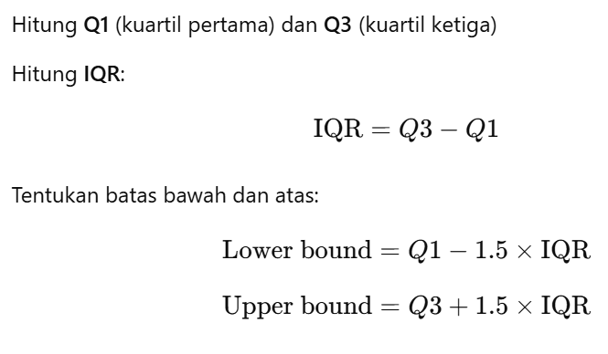

# Laporan Proyek Machine Learning - Merri Putri Panggabean

## 1. Domain Proyek

### 1.1 Latar Belakang

Pendidikan merupakan salah satu aspek penting dalam pembangunan sumber daya manusia. Dalam proses pembelajaran, performa siswa sering kali menjadi indikator utama keberhasilan sistem pendidikan. namun, perfoma ini tidak hanya dipengaruhi oleh kemampuan akademik semata, tetapi juga oleh berbagai faktor lain seperti latar belakang keluarga, kondisi sosial-ekonomi, serta ketersediaan fasilitas belajar.
  
## 1.2 Business Understanding

Dalam dunia pendidikan, memahami faktor-faktor yang memengaruhi performa siswa sangat krusial untuk meningkatkan kualitas pembelajaran dan mencegah ketimpangan hasil akademik. Melalui pendekatan analisis data dan machine learning, kita dapat mengklarifikasi permasalahan, merumuskan tujuan, serta menyusun solusi prediktif untuk membantu pengambilan keputusan di bidang pendidikan.

### 1.3 Problem Statements

Berdasarkan latar belakang diatas, berikut batasan masalah yang akan diselesaikan dalam proyek ini :
- Apakah terdapat perbedaan performa akademik berdasarkan jenis kelamin siswa?
- Apakah mengikuti kursus persiapan ujian berdampak signifikan terhadap skor ujian siswa?
- Bisakah kita memprediksi performa siswa (skor ujian) berdasarkan atribut demografisnya?

### 1.4 Goals

Menjawab batasan masalah yang telah dirangkum dan akan menjawab pertanyaan-pertanyaan diatas, berikut tujuan masalahnya :
- Kita perlu untuk menganalisis perbedaan nilai antar siswa berdasarkan jenis kelamin.
- Kita perlu untuk mengetahui pengaruh kursus persiapan ujian terhadap performa ujian siswa.
- Kita perlu untuk membangun model prediksi performa siswa berdasarkan atribut demografisnya, seperti gender,lunch,tingkat pendidikan orang tua dan status kursus.

### 1.5 Solution Statment

untuk mencapai tujuan diatas, maka kita perlu melakukan pendekatan pemodelan yang dimana kita akan menggunakan algoritma seperti :
- Random Forest (RF) : untuk menangani banyak fitur seperti kolom numerik dan kategorial.
- K-Nearest Neighbors (KNN) : melakukan pertimbangan kesamaan antar siswa dalam prediksi skor.
- Boosting : untuk meningkatkan akurasi prediksi dengan menggabungkan beberapa model lemah menjadi kuat.
- Support Vector Machine (SVM) : untuk menangani masalah klasifikasi dengan melihat perbandingan skor tinggi dan rendah.

**Menggunakan MSE (Mean Absolute Error) pada model yang akan di evaluasi.**

## 2. Data Understanding

Dataset yang digunakan dalam proyek ini berisi informasi tentang performa akademik siswa berdasarkan beberapa faktor demografis dan sosial, seperti jenis kelamin, kelompok etnis, tingkat pendidikan orang tua, status mengikuti kursus persiapan ujian, dan jenis makan siang yang dikonsumsi. Selain itu, dataset ini juga mencatat skor ujian siswa dalam tiga mata pelajaran utama, yaitu **matematika (math score), membaca (reading score), dan menulis (writing score).**

link dataset : https://www.kaggle.com/datasets/spscientist/students-performance-in-exams 

Dataset mentah yang digunakan dalam proyek ini memiliki 1000 baris data dan 8 kolom. Kolom - kolom tersebut terdiri dari 5 kolom kategori dan 3 kolom numerik. untuk penjelasan mengenai variabel-variabel pada Performance Students dataset adalah sebagai berikut:
- gender : jenis kelamin tiap siswa.
- lunch : jenis makan siang yang setia hari di konsumsi tiap siswa.
- race/ethnicity : jenis kelompok etnis tiap siswa. yang sering dikategorikan dari group A sampai group E.
- parental level of education : tingkat pendidikan orang (misalnya: high school, bachelor’s degree).
- test preparation course : status mengikuti kursus persiapan ujian.
- math score : nilai skor ujian matematika.
- reading score : nilai skor ujian membaca.
- writing score : nilai skor ujian menulis.

## 2.1 Langkah - Langkah Pemrosesan data
A. memasukkan dataset kedalam dataframe menggunakan library pandas.
B. menampilkan informasi dari dataset.
C. menampilkan jumlah data statistik pada dataset.
D. menampilkan jumlah missing value dan duplikat data pada dataset.
E. menangani outlier.
F. menampilkan visualisasi antar fitur numerik antar kategorial.

 ## 2.1.A Membuat dataframe dengan library pandas.
Pada proyek ini, menggunakan fungsi **.read** untuk memasukkan dataset PerformanceStudents.csv kedalam bentuk dataframe menggunakan library pandas dan dataframe yang tersimpan ialah **insu_df**. setelah itu, untuk menampilkan 10 data pertama maka menggunakan **.head(10)**. maka berikut tampilannya :

Gambar 1. tampilan 10 data pertama pada dataset insu_df.

## 2.1.B Menampilkan informasi dari dataset.
Pada proyek ini,untuk memahami semua atribut-atribut yang dipakai, memakai fungsi library python yaitu .info() untuk menampilkan atribut-atribut dan baris serta kolom pada dataset. dimana perintah .info() berfungsi untuk menampilkan semua tipe data pada masing-masing atribut dalam dataset.

gambar 2. tampilan informasi pada dataset insu_df.

dari output pada gambar diatas, maka dilihat bahwa :
1. terdapat 3 kolom numerik yaitu **math score, writing score dan reading score**.
2. terdapat 5 kolom kategori yaitu **test preparation course, race/ethnicity, parental level of education, lunch dan age**.
3. memiliki jumlah 1000 baris dan 8 kolom pada dataset.
## 2.1.C Menampilkan data statistik dataset.
Pada proyek ini, menggunakan perintah .describe() untuk menampilkan dan mengetahui statistik dasar dari kolom **math score, reading score, writing score** seperti percentile, mean, standar deviasi, jumlah data, min dan max. maka berikut tampilan tabel 2 :

gambar 3. keluaran statistik pada dataset insu_df menggunakan fungsi .describe(). 

## 2.1.D Menampilkan missing value dan duplikat data pada dataset.
Pada proyek ini, untuk mengetahui data memiliki missing value dan duplikat data, maka menggunakan perintah fungsi .insnull() dan .duplicated() pada dataset insu_df, setelah melakukan perintah tersebut, maka akan menampilkan kolom yang memiliki missing value dan jumlah duplikat. maka beikut tampilannya :

.

Gambar 4. tampilan missing value.
.

Gambar 5. tampilan duplikat data.

## Exploratory Data Analysis
## 2.1.E Melihat outlier pada dataset.
Pada kasus ini, kita akan melihat outlier dalam setiap kolom pada dataset, outlier sendiri adalah hasil pengamatan yang kemunculannya sangat jarang dan berbeda dari hasil pengamatan lainnya. maka berikut tampilan kolom yang outlier :
 
Gambar 6. tampilan sebelum menangani outlier. 
dari gambar diatas, terdapat outlier pada kolom math score,reading score dan writing score. untuk menangani outlier kita dapat menggunakan teknik IQR method. IQR adalah *Interquartile Range*. berikut rumus akan kita pakai : 
 
setelah melakukan penanganan outlier pada kolom dataset, kita dapat melihat hasil dari penanganan outlier yang telah kita lakukan, maka tampilan hasil penganganan outlier, sebagai berikut : 
 
Gambar 7. setelah melakukan pengangan outlier. 
## 2.1.F Menampilkan distribusi numerik dan kategori
**Visualisasi Numeric Fitur**
- Numeric math score
   
  Gambar 8. hasil visualisasi chart bar **math score**. 
  Pada gambar 8 merupakan hasil visualisasi kolom **math score** yang dapat kita lihat bahwa jumlah nilai skor matematika siswa tersebar cukup merata dengan kecenderungan siswa memiliki nilai antara 60-70, distribusi tidak sepenuhnya simetris, dikarenakan ada leih sedikit siswa mendapat nilai tertinggi dan sangat rendah.
- Numeric writing score
   
  Gambar 9. Hasil Visualisasi chart bar **writing score**. 
Pada gambar 9 menampilkan visualisasi writing score yang dapat kita lihat bahwasebagian besar peserta mendapatkan skor menulis di sekitar nilai 60-80, distribusi nilai skor cenderung simetris sekitar nilai 70 dan mengindikasi bahwa skor-skor secara cukup merata disekitar rata-rata. 
- Numeric reading score
 
Gambar 10. Hasil visualisasi chart bar **reading score** 
Pada gambar 10 menampilkan hasil visualisasi rading score yang dapat kita lihat bahwa sebagian siswa mendapatkan nilai skor antara 60-80 serta nilai yang sangat rendah antar 40 dan tertinggi antara 90 tetapi jarang diperoleh.

**Visualisasi Kategori Fitur**
- kategori gender
 
Gambar 11. Hasil Visualisasi kolom **gender**. 
Gambar 12. Hasil visualisasi kolom **lunch**. 
Pada gambar 12, dapat kita lihat bahwa jenis makan siang yang lebih tinggi ialah *standar* daripada *free/recuded* yang lebih rendah.
## Data Preparation
Pada bagian ini Anda menerapkan dan menyebutkan teknik data preparation yang dilakukan. Teknik yang digunakan pada notebook dan laporan harus berurutan.

**Rubrik/Kriteria Tambahan (Opsional)**: 
- Menjelaskan proses data preparation yang dilakukan
- Menjelaskan alasan mengapa diperlukan tahapan data preparation tersebut.

## Modeling
Tahapan ini membahas mengenai model machine learning yang digunakan untuk menyelesaikan permasalahan. Anda perlu menjelaskan tahapan dan parameter yang digunakan pada proses pemodelan.

**Rubrik/Kriteria Tambahan (Opsional)**: 
- Menjelaskan kelebihan dan kekurangan dari setiap algoritma yang digunakan.
- Jika menggunakan satu algoritma pada solution statement, lakukan proses improvement terhadap model dengan hyperparameter tuning. **Jelaskan proses improvement yang dilakukan**.
- Jika menggunakan dua atau lebih algoritma pada solution statement, maka pilih model terbaik sebagai solusi. **Jelaskan mengapa memilih model tersebut sebagai model terbaik**.

## Evaluation
Pada bagian ini anda perlu menyebutkan metrik evaluasi yang digunakan. Lalu anda perlu menjelaskan hasil proyek berdasarkan metrik evaluasi yang digunakan.

Sebagai contoh, Anda memiih kasus klasifikasi dan menggunakan metrik **akurasi, precision, recall, dan F1 score**. Jelaskan mengenai beberapa hal berikut:
- Penjelasan mengenai metrik yang digunakan
- Menjelaskan hasil proyek berdasarkan metrik evaluasi

Ingatlah, metrik evaluasi yang digunakan harus sesuai dengan konteks data, problem statement, dan solusi yang diinginkan.

**Rubrik/Kriteria Tambahan (Opsional)**: 
- Menjelaskan formula metrik dan bagaimana metrik tersebut bekerja.

**---Ini adalah bagian akhir laporan---**

_Catatan:_
- _Anda dapat menambahkan gambar, kode, atau tabel ke dalam laporan jika diperlukan. Temukan caranya pada contoh dokumen markdown di situs editor [Dillinger](https://dillinger.io/), [Github Guides: Mastering markdown](https://guides.github.com/features/mastering-markdown/), atau sumber lain di internet. Semangat!_
- Jika terdapat penjelasan yang harus menyertakan code snippet, tuliskan dengan sewajarnya. Tidak perlu menuliskan keseluruhan kode project, cukup bagian yang ingin dijelaskan saja.

